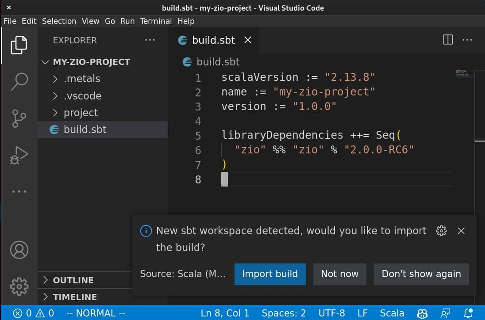

ZIO is a _type-safe_ library for building asynchronous and concurrent applications. The Scala compiler can catch a lot of errors at compile time since it is type-safe. This ensures that our code is mostly correct, and it prevents lots of bugs from creeping into the runtime. So having a type-safe editor that highlights errors will improve our development experience. VSCode with the power of the _Metals_ extension provides us with a type-safe editor for writing Scala programs.

In this tutorial, we will walk through how to run our first ZIO project with VSCode. We will start by creating a new project and then importing that into the VSCode workspace.

## Requirements

In this article, we assume that we have already downloaded and installed the following tools:
- [SBT build tool](https://www.scala-sbt.org/download.html)
- [VSCode](https://code.visualstudio.com/)

## Creating a new ZIO project

1. First, we need to create a new directory where we should put our project files:

```bash
mkdir my-zio-project
cd my-zio-project
```

2. Next, we need to create a new `build.sbt` file:

```bash
touch build.sbt
```

Inside this file, let's add the following lines which include the version of Scala language, the name of our project, and the dependencies we want to use:

```scala
scalaVersion := "2.13.10"
name := "my-zio-project"
version := "0.0.1"

libraryDependencies ++= Seq(
  "zio" %% "zio" % "2.0.0-RC6"
)
```

3. Also, we need to specify the SBT version we want to use in the `project/build.properties` file:

```bash
mkdir project
touch project/build.properties
```

Now, let's add the following lines to the `project/build.properties` file:

```
sbt.version = 1.6.2
```

4. We are ready to open our project in VsCode. We can do this by opening the `my-zio-project` directory from the `File > Open Folder` menu.

5. When we open a project that has a `build.sbt` file, the _Metals_ extension will automatically detect the project and prompt us with the following message:



6. By clicking on the `Import Build` button, the _Metals_ will try to download the dependencies from the `build.sbt` file and then import the whole project into the workspace.

7. After that, we are ready to write our first ZIO program by creating a new file called `MainApp.scala` inside the `src/main/scala` directory:

```bash
$ mkdir src/main/scala
$ touch src/main/scala/MainApp.scala
```

Let's add the following lines to our `MainApp.scala` file:

```scala mdoc:compile-only
import zio._

object MainApp extends ZIOAppDefault {
  def run = 
    for {
      name <- Console.readLine("What is your name? ")
      _    <- Console.printLine(s"Hello, $name!")
    } yield ()
}
```

Now, we can run our program by clicking on the _run_ button above the `MainApp` object.

After we have imported our project using _Metals_, the editor can highlight syntax errors, type-check our code, and run the program. Additionally, it provides code completion that helps us choose the right method. Another handy feature is the ability to jump to the definition of methods and classes just by _Ctrl + Click_ing on them.

## Diagnosing the Build

Sometime, the build may fail. To diagnose the build, the first place to look is the _Metals_ output, which can be found in the _Output Window_ in the VSCode. The output window can be opened by typing _Toggle Output_ in the command palette (`Ctrl + Shift + P`).

The _Metals_ also provide a build diagnostics panel called _Metals Doctor_ which can be opened by typing _Metals: Run doctor_ in the command palette. This command will show us the status of the build and if there are any errors, it will guide us on how to fix them.

## Conclusion

In this tutorial, we have learned how to run a ZIO project with VSCode using the Metals extension. VSCode along with the Metals extension provide lots of handy features that improve the productivity of developers. To learn more about this, we recommend reading the [Metals documentation for VSCode editor](https://scalameta.org/metals/docs/editors/vscode/).
